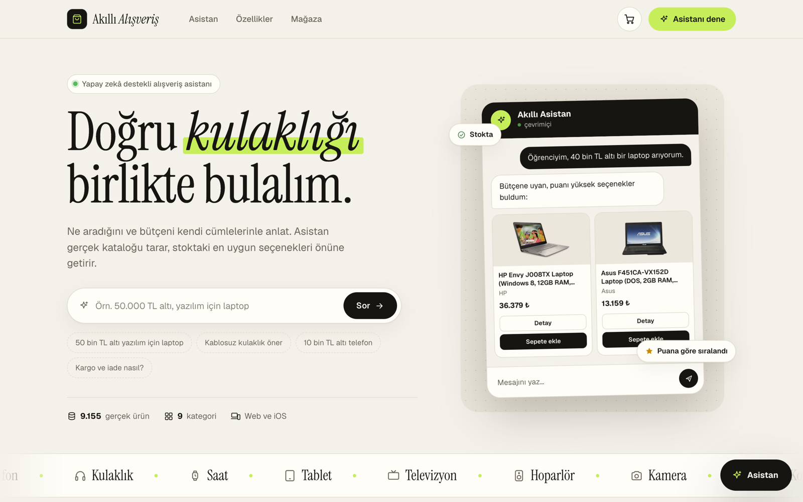
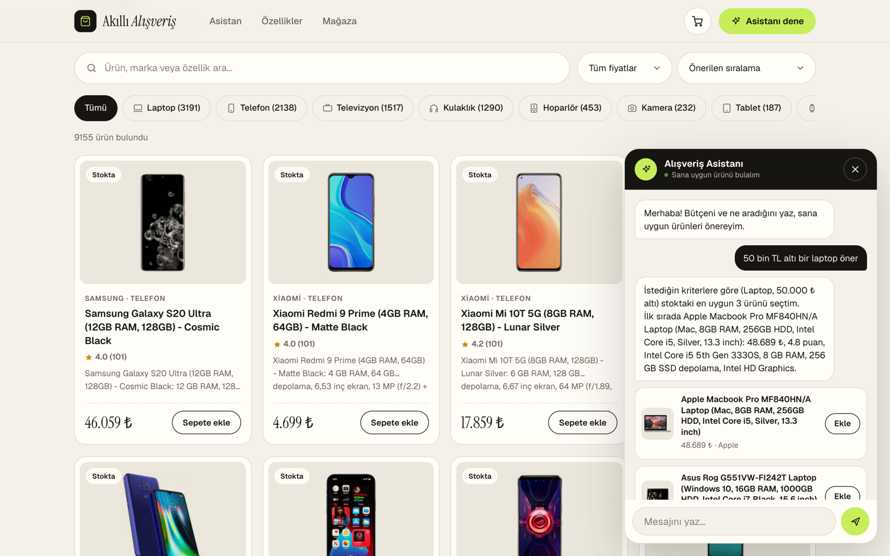
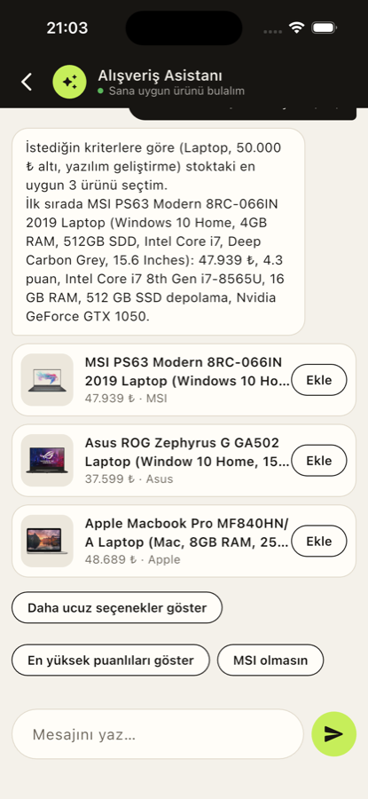
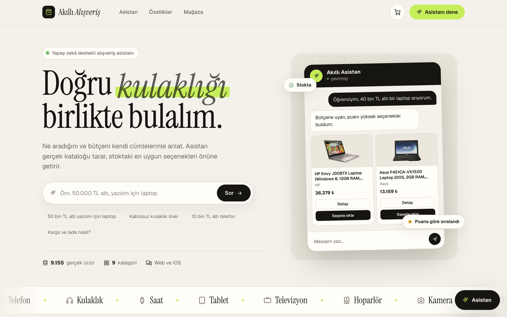
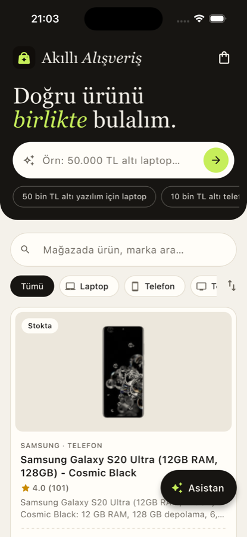
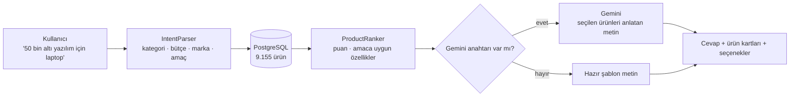

<p align="center">
  
</p>

<h1 align="center">Akıllı Alışveriş</h1>

<p align="center">
  Ne aradığını kendi cümlelerinle anlat, asistan <b>gerçek ürün kataloğundan</b> sana en uygununu bulsun.<br>
  Web sitesi ve iOS uygulaması, tek bir .NET sunucusu.
</p>

<p align="center">
  <a href="https://akilli-alisveris.onrender.com"><b>Canlı demo →</b></a>
  &nbsp;·&nbsp; <a href="#nasıl-çalışır">Nasıl çalışır</a>
  &nbsp;·&nbsp; <a href="#yerelde-çalıştırma">Yerelde çalıştırma</a>
</p>

<p align="center">
  
  
  
  
  
</p>



> Ücretsiz sunucu 15 dakika kullanılmazsa uyur. İlk açılış 30-60 saniye sürebilir.

## Öne çıkanlar

- **Doğal dilde arama:** "Öğrenciyim, 40 bin TL altı laptop" gibi bir cümleden bütçe, kategori, marka ve kullanım amacı çıkarılır.
- **Uydurma yok:** Asistan yalnızca veritabanındaki ürünleri önerir. Fiyat, puan ve özellikler katalogdan gelir.
- **Stok farkındalığı:** Tükenen ürünler önerilmez, "son 3 adet" gibi durumlar gösterilir.
- **Takip soruları:** "Daha ucuz seçenekler", "MSI olmasın" gibi hazır cevaplarla sohbet sürdürülür.
- **Sohbetten sepete:** Önerilen ürün sohbetten çıkmadan sepete eklenir.
- **Mağaza politikaları:** Kargo, iade ve garanti sorularına anında cevap verir.
- **Tek sunucu, iki istemci:** Web sitesi ve Flutter iOS uygulaması aynı API'yi kullanır.

<table>
  <tr>
    <td width="68%"></td>
    <td width="32%"></td>
  </tr>
  <tr>
    <td align="center"><sub>Web: mağaza ve asistan paneli</sub></td>
    <td align="center"><sub>iOS: asistan önerileri</sub></td>
  </tr>
  <tr>
    <td></td>
    <td></td>
  </tr>
  <tr>
    <td align="center"><sub>Web: özellikler</sub></td>
    <td align="center"><sub>iOS: ana ekran ve katalog</sub></td>
  </tr>
</table>

## Nasıl çalışır?

Asistanın kalbinde basit bir kural var: **ürünleri kod seçer, dil modeli yalnızca metni yazar.** Böylece model olmayan bir ürün, yanlış bir fiyat ya da tükenmiş bir stok uyduramaz.



1. **`IntentParser`** cümleden bütçeyi ("40 bin", "50.000 TL altı"), kategoriyi, markayı ve kullanım amacını (oyun, yazılım, öğrenci…) kural tabanlı olarak çıkarır.
2. Veritabanında bütçeye ve kategoriye uyan, stoktaki adaylar aranır. **`ProductRanker`** bunları kullanıcı puanına, değerlendirme sayısına ve amaca uygun özelliklere göre sıralar (ör. oyun için ayrı ekran kartı ve 16 GB RAM artı puan alır).
3. **Gemini** (isteğe bağlı) yalnızca seçilen gerçek ürünleri anlatan kısa bir metin yazar. Anahtar yoksa ya da Gemini cevap vermezse hazır şablon kullanılır, asistan hiç susmaz.

## Teknolojiler

| Katman | Kullanılan |
|---|---|
| API | ASP.NET Core Minimal API (.NET 8), EF Core, Npgsql, hız sınırlama, `/healthz` |
| Veritabanı | PostgreSQL (üretimde Neon) |
| Web | Düz HTML, CSS ve JavaScript. Çerçeve yok, API tarafından sunulur |
| Mobil | Flutter (iOS) |
| Yapay zekâ | Google Gemini (yalnızca metin üretimi, isteğe bağlı) |
| Yayın | Docker, Render Blueprint (`render.yaml`), GitHub'a push'ta otomatik deploy |

```
web/      site (index.html, style.css, app.js)
mobile/   Flutter iOS uygulaması
backend/  ASP.NET Core API
  Assistant/  IntentParser, ProductRanker, StorePolicies
  Services/   ChatService, ProductQuery
  Import/     Gadgets360 CSV içe aktarıcı
data/     ham veri seti (git'e girmez)
docs/     ekran görüntüleri
```

## API

| Uç nokta | Açıklama |
|---|---|
| `GET /api/products?q=&category=&maxPrice=&sort=&page=` | Ürün listesi (arama, filtre, sıralama, sayfalama) |
| `GET /api/products/{id}` | Tek ürün |
| `GET /api/facets` | Kategoriler, ürün ve marka sayıları |
| `POST /api/chat` | Asistan: `{ messages: [{ role, content }] }` → cevap, ürünler, seçenekler |
| `GET /healthz` | Sağlık kontrolü |

## Yerelde çalıştırma

```bash
docker start shopping-postgres            # PostgreSQL (port 5433)
cd backend/ShoppingAssistant.Api
dotnet run --launch-profile http          # http://localhost:5065  (isteğe bağlı: GEMINI_API_KEY=...)
```

Ürün verisini yüklemek için: `dotnet run --no-launch-profile -- import gadgets360 --purge` (CSV'ler `data/gadgets360/` içinde).

iOS uygulaması varsayılan olarak canlı sunucuya bağlanır. Yerel sunucu için:

```bash
cd mobile
flutter run --dart-define=API_URL=http://BILGISAYAR_IP:5065
```

### Ortam değişkenleri

| Ad | Açıklama |
|---|---|
| `DATABASE_CONNECTION_STRING` | PostgreSQL adresi (`Host=...` ya da `postgresql://...`) |
| `GEMINI_API_KEY` | İsteğe bağlı, asistan metinlerini doğallaştırır |
| `AUTO_MIGRATE` | `true` ise açılışta tabloları kurar |
| `WebRoot` | Site dosyaları klasörü (Docker'da `/app/web`) |

Gizli bilgileri koda ya da git'e koyma. Yayına alma adımları: [DEPLOY.md](DEPLOY.md).

## Veri hakkında

Ürünler Kaggle'daki **Gadgets360 Electronics Dataset**'ten alınmıştır (Ocak 2021, Hindistan pazarı). Fiyatlar ₹'dan ₺'ye çevrilmiştir. Stok ve mağaza politikaları **demo** amaçlıdır, siparişler gerçek değildir.
